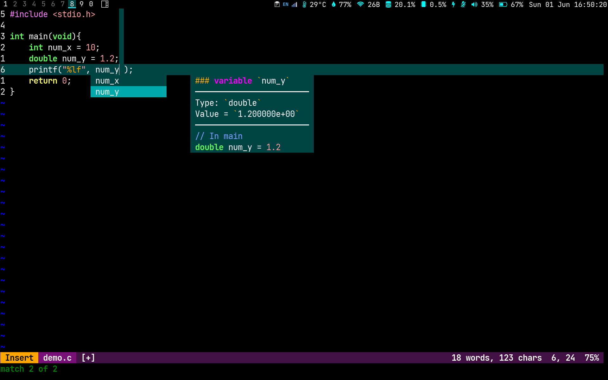
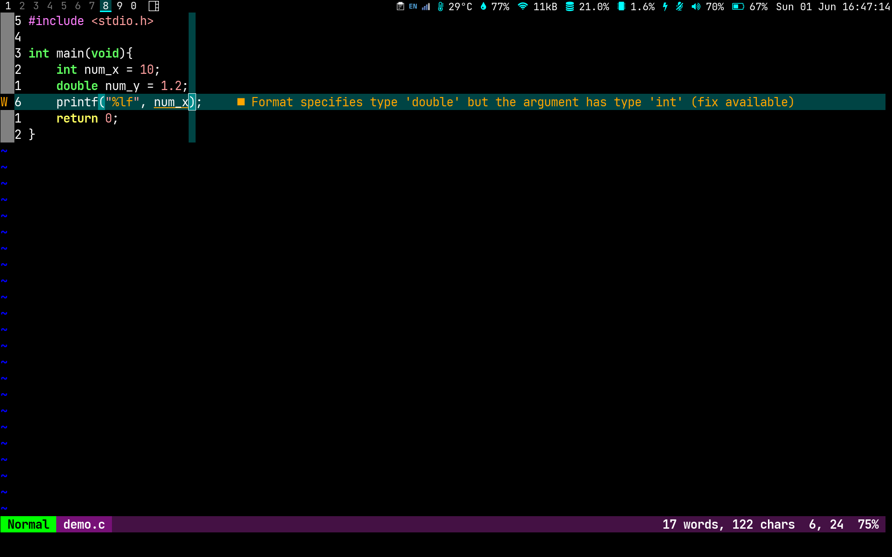
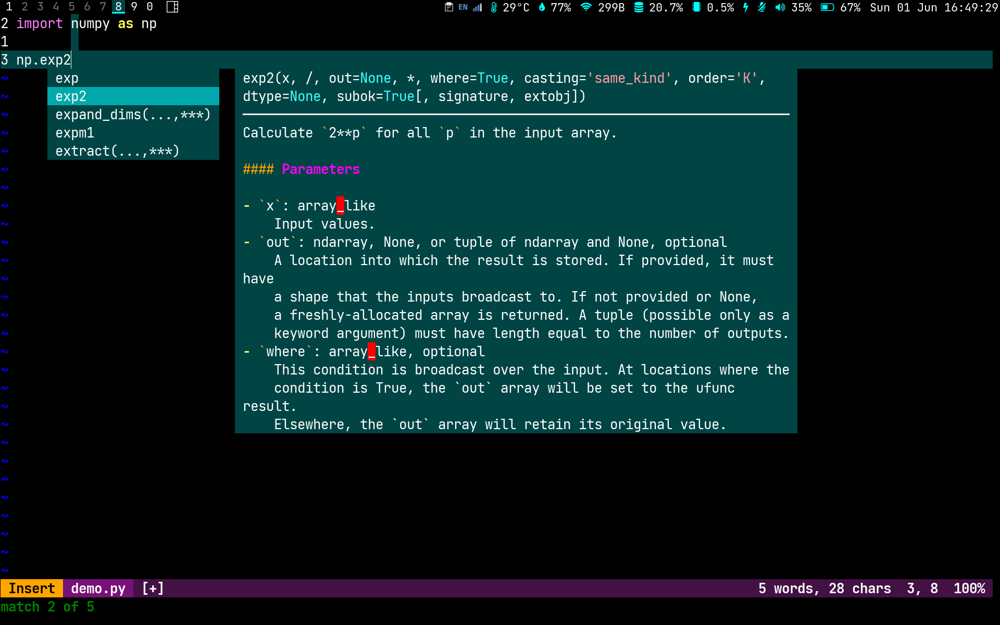

# Vim Config without Plugin

I like default colour scheme btw, don't judge me:)

## Dependencies

* NVIM >= v0.7.0
```bash
sudo apt install neovim
```
* pylsp
```bash
sudo apt install python3-pylsp
```
* clangd
```bash
sudo apt install clangd
```
* pandoc
```bash
sudo apt install pandoc
```

## Spell Check

Spell check will be on by default when you open files with extention `.txt`, `.tex`, `.md` and `.html`.

## Custom keybindings

| mode | key | function |
|:---:|:---:|:---:|
| Normal | ctrl+space | list suggestions from LSP |
| Normal | space+s | toggle spell checking on and off |
| Normal | space+p | open pdf of the same name (if there is one) |
| Normal | space+r/shift+F10 | compile and run C/C++ code or run python code or compile latex/markdown to pdf |
| Normal | space+h | show a list of keybindings that are useful but rarely mentioned |
| Normal | K | popup preview |
| Insert | ctrl+backspace | delete whole word |
| Visual | J | move selected text downward |
| Visual | K | move selected text upward |
| Visual | space+r | replace selected texts globally |

## Custom function
### Latex

* Reference bibtex on the first run
* Compile latex on save
* Clean up helper files on exit

### Markdown

* Compile markdown on save only when there is a pdf file with the same name as the markdown file in the same directory

## Screenshots

* C variable suggestions popup




* C error hint



* numpy function suggestions popup


